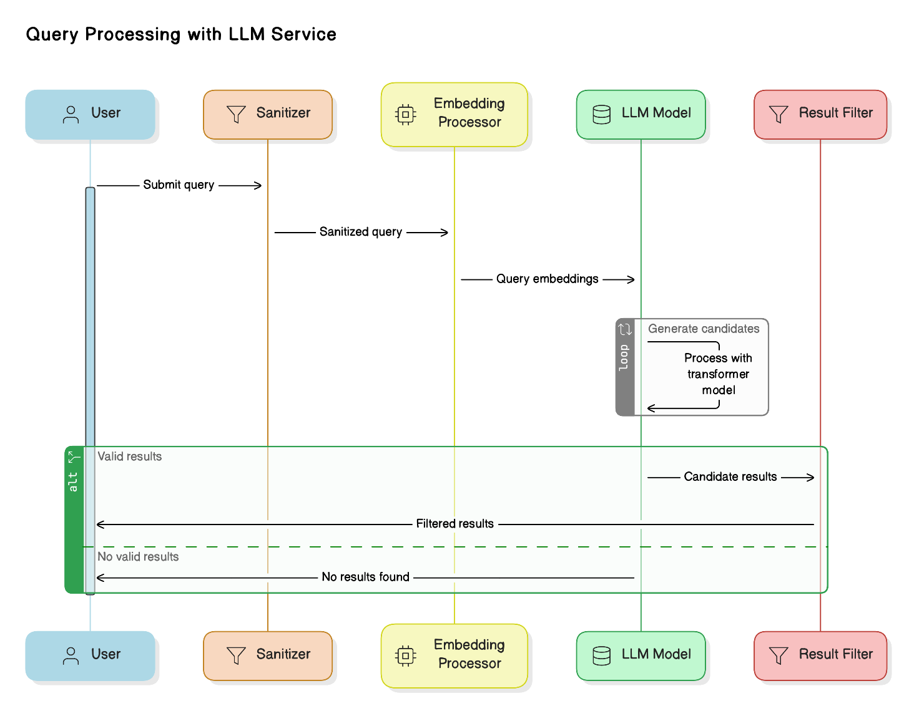
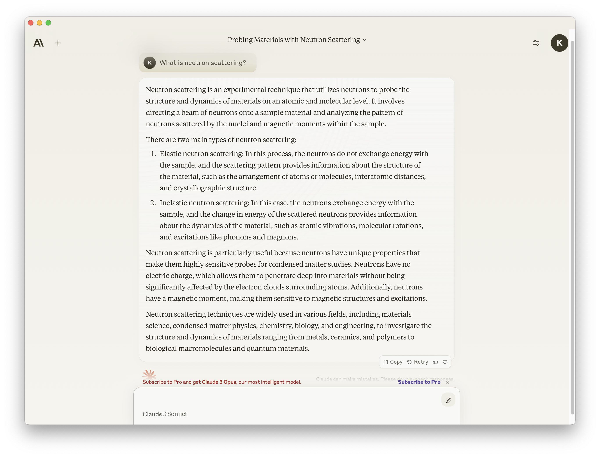
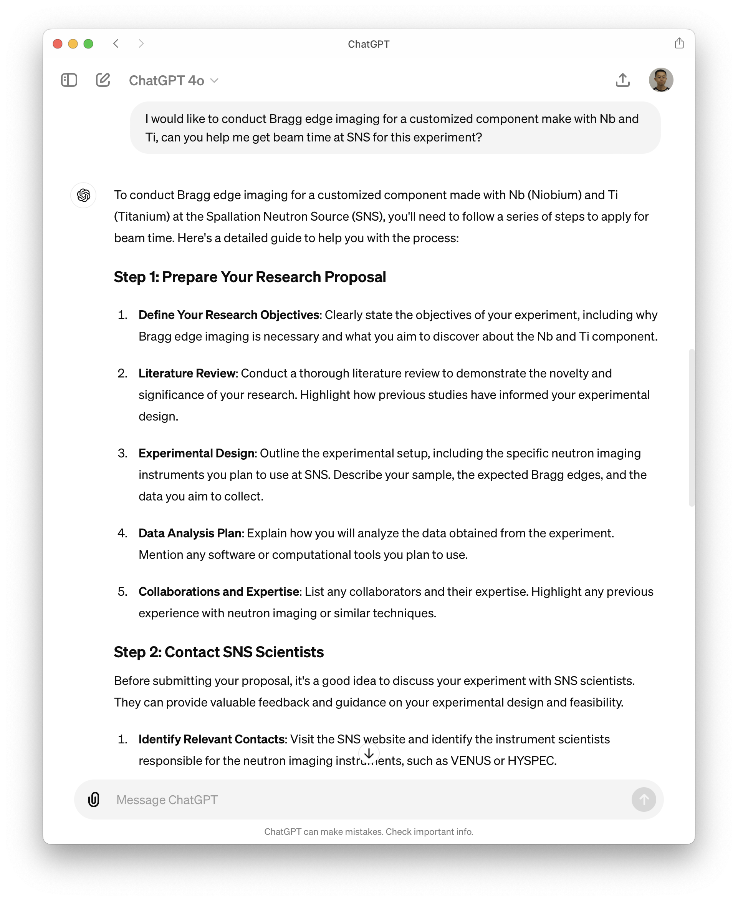
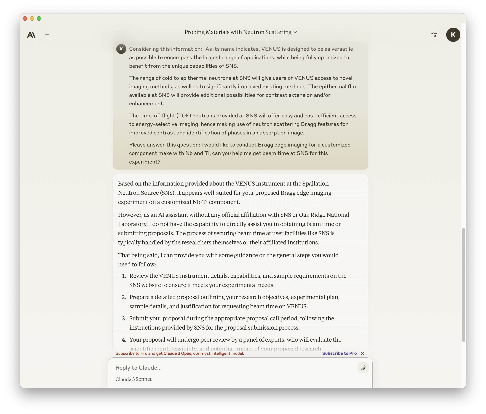
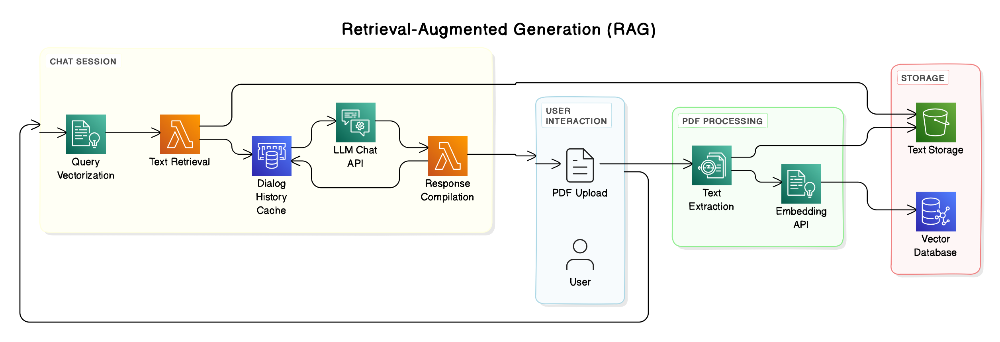

# Optimizing Local Language Models for Neutron Science: A Dual Approach with RAG and LoRA

Chen Zhang, 2024

---

- Breif introduction to LLMs
- Is public LLMs services enough for us?
- Retrieval-Augmented Generation (RAG)
- Fine-Tuning with LoRA (Low-Rank Adaptation)
- Summary

---
<!-- header : "⚛🦙🦜🔗::Breif introduction to LLMs" -->

- LLM: deep learning models trained on massive datasets of __text__ to understand and generate human-like language.
- Why does LLM work:
    * Scale
	* Deep Learning
	* **Transformer Architecture**: fast training possible, still slow (and expensive) inference.

---
<!-- header : "⚛🦙🦜🔗::Is ChatGPT enough for us?" -->

## Strengths:
    - Excellent at handling general and casual questions.
	- Understands and generates human-like responses.
	- Useful for a wide range of topics due to broad training data.

## Limitations:
	- Lacks facility and instrument-specific information.
	- No access to internal documents.
	- Data privacy concerns.

---
<!-- header : "⚛🦙🦜🔗::Is public LLMs services enough for us?" -->

| Generic Question | Specific Question |
| --- | --- |
|  |  |

---
<!-- header : "⚛🦙🦜🔗::Is public LLMs services enough for us?" -->

| Generic Question | Specific Question |
| --- | --- |
|  |  |

---
<!-- header : "⚛🦙🦜🔗::Is public LLMs services enough for us?" -->

What if we give the LLMs some relevant information to help?

| ChatGPT | Claude |
| --- | --- |
|  |  |

---
<!-- header : "⚛🦙🦜🔗::Retrieval-Augmented Generation (RAG)" -->
<!-- Introduction -->

RAG combines retrieval and generation to enhance language model responses with relevant external information.

---
<!-- header : "⚛🦙🦜🔗::Retrieval-Augmented Generation (RAG)" -->
<!-- Demo Time -->

---
<!-- header : "⚛🦙🦜🔗::Retrieval-Augmented Generation (RAG)" -->
<!-- Limitations -->

---
<!-- header : "⚛🦙🦜🔗::Fine-Tuning with LoRA (Low-Rank Adaptation)" -->
<!-- Introduction -->

---
<!-- header : "⚛🦙🦜🔗::Fine-Tuning with LoRA (Low-Rank Adaptation)" -->
<!-- Demo Time -->

---
<!-- header : "⚛🦙🦜🔗::Summary" -->
