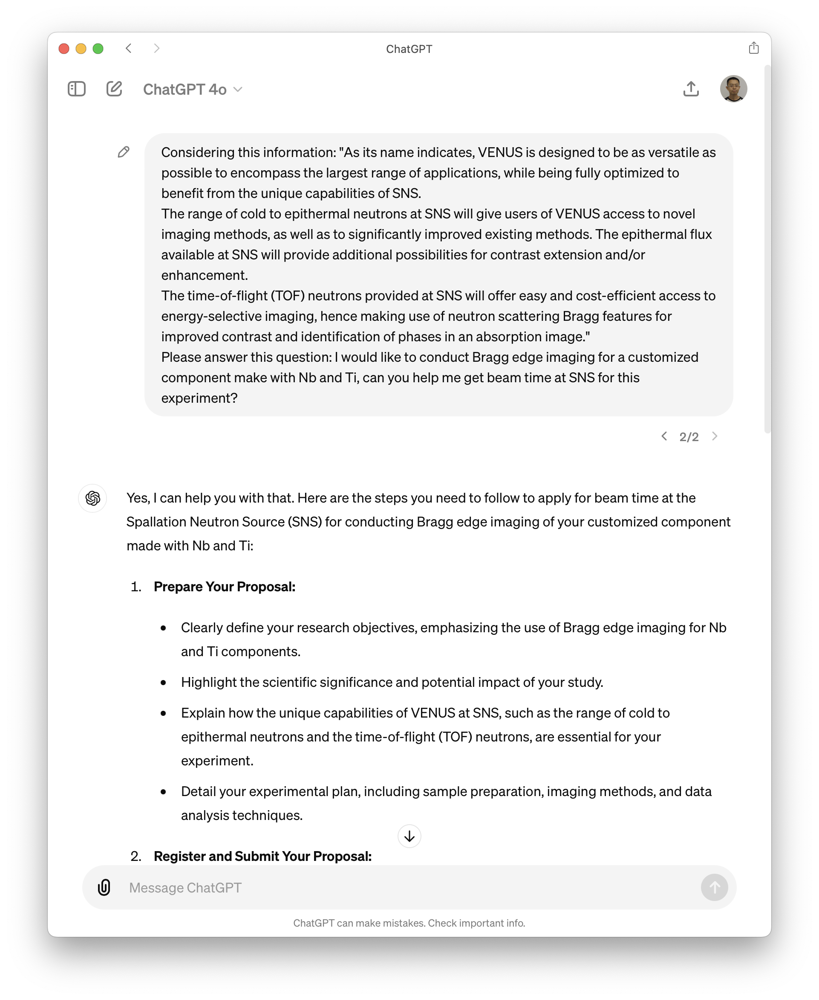

# Optimizing Local Language Models for Neutron Science: A Dual Approach with RAG and LoRA

Chen Zhang, 2024

---

- Breif introduction to LLMs
- Is public LLMs services enough for us?
- Retrieval-Augmented Generation (RAG)
- Fine-Tuning with LoRA (Low-Rank Adaptation)
- Summary

---
<!-- header : "⚛🦙🦜🔗::Breif introduction to LLMs" -->

- LLM: deep learning models trained on massive datasets of __text__ to understand and generate human-like language.
- Why does LLM work:
    * Scale
	* Deep Learning
	* **Transformer Architecture**: fast training possible, still slow (and expensive) inference.

---
<!-- header : "⚛🦙🦜🔗::Is ChatGPT enough for us?" -->

## Strengths:
    - Excellent at handling general and casual questions.
	- Understands and generates human-like responses.
	- Useful for a wide range of topics due to broad training data.

## Limitations:
	- Lacks facility and instrument-specific information.
	- No access to internal documents.
	- Data privacy concerns.

---
<!-- header : "⚛🦙🦜🔗::Is public LLMs services enough for us?" -->

| Generic Question | Specific Question |
| --- | --- |
|  |  |

---
<!-- header : "⚛🦙🦜🔗::Is public LLMs services enough for us?" -->

| Generic Question | Specific Question |
| --- | --- |
|  |  |

---
<!-- header : "⚛🦙🦜🔗::Is public LLMs services enough for us?" -->

What if we give the LLMs some relevant information to help?

| ChatGPT | Claude |
| --- | --- |
|  |  |

---
<!-- header : "⚛🦙🦜🔗::Retrieval-Augmented Generation (RAG)" -->
<!-- Introduction -->

RAG combines retrieval and generation to enhance language model responses with relevant external information.

---
<!-- header : "⚛🦙🦜🔗::Retrieval-Augmented Generation (RAG)" -->
<!-- Demo Time -->
* Q1: What is bm3dornl?
<iframe src="http://localhost:8501" height=1000 width=1100 scrolling=1></iframe>

---
<!-- header : "⚛🦙🦜🔗::Retrieval-Augmented Generation (RAG)" -->
<!-- Demo Time -->
* Q2: Can you give me an example of how to use bm3dornl for ring artifact removal?
<iframe src="http://localhost:8501" height=1000 width=1100 scrolling=1></iframe>

---
<!-- header : "⚛🦙🦜🔗::Retrieval-Augmented Generation (RAG)" -->
<!-- Demo Time -->
* Q3: What does the PatchManager class do in bm3dornl?
<iframe src="http://localhost:8501" height=1000 width=1100 scrolling=1></iframe>

---
<!-- header : "⚛🦙🦜🔗::Retrieval-Augmented Generation (RAG)" -->
<!-- Limitations -->

## Limitations of Retrieval-Augmented Generation (RAG):

Scalability Issues:

	• Managing large-scale document retrieval can be resource-intensive.
	• Requires efficient indexing and retrieval systems to handle extensive datasets.

Dependence on Data Quality:

	• The accuracy of responses depends on the quality and relevance of the retrieved documents.
	• Poorly maintained or outdated data can lead to incorrect or suboptimal answers.

Context Limitation:

	• Limited by the context window size of the LLM, which can affect how much retrieved information can be used.
	• Relevant information might get truncated if the context window is exceeded.

etc.

---
<!-- header : "⚛🦙🦜🔗::Fine-Tuning with LoRA (Low-Rank Adaptation)" -->
<!-- Introduction -->

What is LoRA?

- LoRA (Low-Rank Adaptation) is a technique for fine-tuning pre-trained language models with a small number of additional parameters.
- It allows efficient adaptation to specific tasks without retraining the entire model.

---
<!-- header : "⚛🦙🦜🔗::Fine-Tuning with LoRA (Low-Rank Adaptation)" -->
<!-- Introduction -->

Benefits of Using LoRA:

- Efficiency:
	• Reduces computational resources and time required for fine-tuning.
- Flexibility:
	• Allows quick adaptation to new domains or specific tasks.
- Scalability:
	• Can be applied to large pre-trained models without significant overhead.

---
<!-- header : "⚛🦙🦜🔗::Fine-Tuning with LoRA (Low-Rank Adaptation)" -->
<!-- Introduction -->

Application in ⚛ Science:
- Fine-tuning a locally hosted LLM to handle neutron science-specific queries.
- Enhances model performance on domain-specific tasks and datasets.

---
<!-- header : "⚛🦙🦜🔗::Fine-Tuning with LoRA (Low-Rank Adaptation)" -->
<!-- Demo Time -->

<iframe src="http://localhost:8501" height=1000 width=1100 scrolling=1></iframe>

---
<!-- header : "⚛🦙🦜🔗::Summary" -->

### Key Takeaways

- LLMs are powerful tools for text-centric tasks.
- Commercial LLM services excel at general questions but lack specific domain knowledge and face privacy concerns.
- RAG provides more accurate, context-specific answers, but faces scalability and data quality challenges.
- LoRA allows efficient fine-tuning of LLMs.
- For ⚛, both RAG and LoRA can be valuable tools for customizing LLMs to handle domain-specific queries and tasks.
