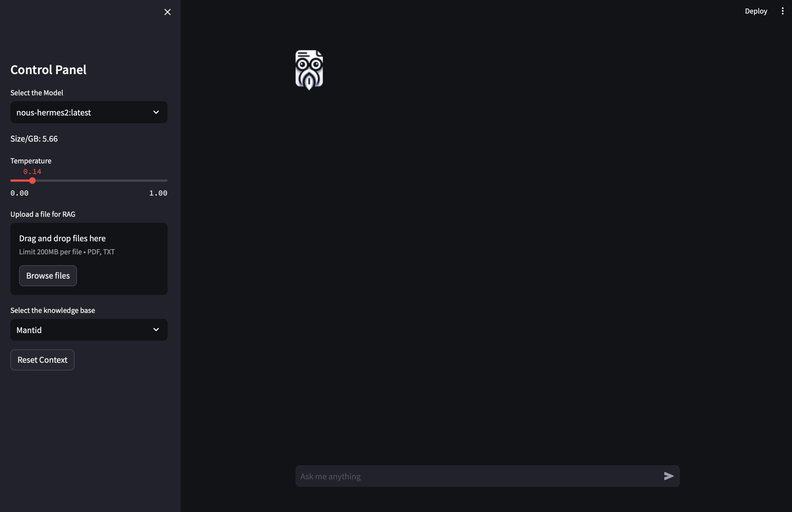

# DocSage: chat with your documents locally

https://github.com/KedoKudo/DocSage

---



---

## What is DocSage?

- A simple RAG (Retrieval-Augmented Generation) model for local document search and chat.
- Backend:
    - **Ollama**: a local-host LLM server that allows users to run different LLMs models directly.
    - **Langchain**: a mature framework that allows users to send context embeddings to LLM service for context awear text generation.
- Frontend:
    - **Streamlit**: a low-coding Python library that allows users to spin up a simple web applications.

---

## Ollama(🦙)


https://ollama.com, https://github.com/ollama/ollama

```bash
brew install ollama
brew services start ollama
ollama run llama2
```

---

## Langchain


https://python.langchain.com, https://www.langchain.com

```bash
pip install langchain
```

---

## Streamlit


https://streamlit.io, https://github.com/streamlit/streamlit

```bash
pip install streamlit
```

---

## What is RAG?

[](https://mermaid.live/edit#pako:eNp1kc9qwzAMh1_F-NRB-gI5DJam6wYt7A_rJSlDtdXGkNiZLG-Upu8-p-522KhPQv5-n7B1lMpplLncte5LNUAsli-1FfHcVW8eSZROhQ4t-42YTm-HebdFrY3d3werBlFM8Kfhb1KuGDkxeHaEg5hVa1SxLIFhCx43CSqPZ_lzQDqcUuCPeT75GC_f__nnFz8CqebqgFmiCJkMfmImeud5EItquVxdkIfqiXC6DaZlsS6LTUq0DnQmXM_GWWijP8GLX18gO4jHitD3znr0Z5vMZIfUgdHxL49jp5bcYIe1zGOpcQeh5VrW9hRRCOxeD1bJnClgJkOvgbE0sCfoZL6D1scuahPftUr7Oa_p9A0WN4-U)

---

## Demo

### Case 1: simple interaction with DocSage

- testing prompt: "What is Mantid?"
- temperature: 0.1, 0.5, 0.9

---

### Case 2: chat with your documents

- testing prompt: "What is ornl-next?"
- temperature: 0.1, 0.5, 0.9

---

### Case 3: chat with knowledge base

- testing prompt: "Provide a python script to calibrate PowGEN detector with mantid"
- temperature: 0.1, 0.5, 0.9
- knowledge base: Mantid

---

### Q&A
